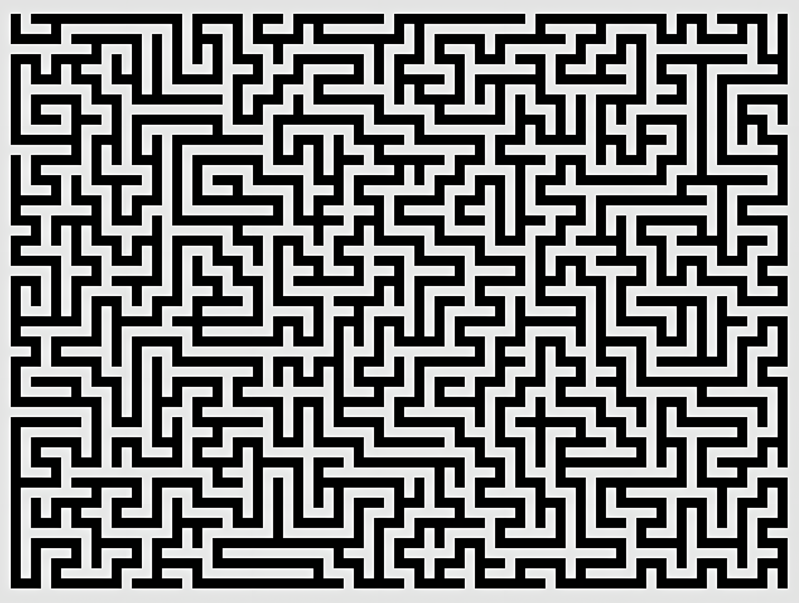

Google Maps sabe exactamente cuál es la ruta más rápida para llegar a tu destino esquivando el tráfico, un mensaje de WhatsApp cruza el mundo a través de miles de servidores en milisegundos. Todo esto se apoya en la teoría de grafos y en una de las mentes más innovadoras de la ingeniería informática: **Edsger W. Dijkstra**.

Creado en 1956 y publicado en 1959, el algoritmo de Dijkstra es la solución perfecta y definitiva al problema de encontrar el camino más corto entre un nodo origen y todos los demás nodos en un grafo con pesos no negativos.

## Cómo Funciona

Para entender a Dijkstra, primero debemos imaginar el problema como un mapa. Las ciudades son los **nodos** (o vértices) y las carreteras que las unen son las **aristas**. Cada carretera tiene un coste asociado (distancia, tiempo, peaje o latencia), al que llamamos **peso**.

El algoritmo sigue una lógica voraz (*greedy approach*):

1. **Inicialización:** Asigna una distancia tentativa de `0` al nodo de inicio y de `infinito` a todos los demás. Marca todos los nodos como "no visitados".
2. **Evaluación:** Desde el nodo actual, calcula la distancia a todos sus vecinos no visitados sumando el peso de la arista que los conecta. Si esta nueva distancia es menor que la distancia tentativa guardada previamente, actualiza el valor.
3. **Avance:** Una vez revisados todos los vecinos del nodo actual, márcalo como "visitado". Un nodo visitado no se volverá a comprobar.
4. **Iteración:** Selecciona el siguiente nodo no visitado con la distancia tentativa más pequeña y repite el proceso hasta llegar al nodo destino (o hasta visitar todos los nodos).



## Complejidad Computacional

El rendimiento de este algoritmo depende en gran medida de las estructuras de datos que utilicemos para implementarlo.

Si implementamos la lista de nodos no visitados como un array simple (o lista), el tiempo de búsqueda del nodo con la distancia mínima toma $O(V)$, lo que nos da una complejidad temporal total de:

$$O(V^{2})$$

Donde V es el número de vértices.

Sin embargo, en aplicaciones de ingeniería de software modernas, solemos utilizar una **Cola de Prioridad** (típicamente implementada con un *Min-Heap*) para extraer el nodo con la distancia mínima de forma mucho más eficiente. Esto reduce drásticamente la complejidad temporal a:

$$O(E + V \log (V))$$

Donde E representa el número de aristas (conexiones). Esta optimización es crucial cuando trabajamos con redes masivas donde los nodos tienen pocas conexiones relativas a la inmensidad de la red (grafos dispersos).

## Ejemplo Práctico del Algoritmo

Para lograr la complejidad óptima de $O(E + V \log V)$ que comentamos en las secciones anteriores, utilizamos el módulo integrado heapq. Esta estructura de datos actúa como nuestra Cola de Prioridad (Min-Heap), permitiéndonos extraer siempre el nodo no visitado más cercano en tiempo logarítmico, en lugar de escanear toda la red.

```python
import heapq

def dijkstra(grafo, nodo_origen):
    """
    Calcula el camino más corto desde un nodo origen a todos los demás 
    nodos en un grafo con pesos no negativos.
    """
    # 1. Inicialización: Todas las distancias a infinito, excepto el origen a 0
    distancias = {nodo: float('infinity') for nodo in grafo}
    distancias[nodo_origen] = 0
    
    # Nuestra cola de prioridad almacenará tuplas de (distancia_acumulada, nodo)
    # Empezamos insertando el nodo origen
    cola_prioridad = [(0, nodo_origen)]
    
    while cola_prioridad:
        # 2. Extracción: Obtenemos el nodo con la menor distancia registrada hasta ahora
        distancia_actual, nodo_actual = heapq.heappop(cola_prioridad)
        
        # Si sacamos un nodo que ya habíamos visitado con una distancia menor, lo ignoramos
        if distancia_actual > distancias[nodo_actual]:
            continue
            
        # 3. Evaluación de vecinos: Revisamos todas las conexiones del nodo actual
        for vecino, peso in grafo[nodo_actual].items():
            # Calculamos la distancia tentativa sumando el peso de la arista
            distancia_tentativa = distancia_actual + peso
            
            # 4. Relajación: Si encontramos un camino más corto, actualizamos
            if distancia_tentativa < distancias[vecino]:
                distancias[vecino] = distancia_tentativa
                # Añadimos el vecino actualizado a la cola para evaluarlo más adelante
                heapq.heappush(cola_prioridad, (distancia_tentativa, vecino))
                
    return distancias

# --- Ejemplo práctico de uso ---
# Representamos el mapa como un diccionario (Lista de Adyacencia)
mapa_rutas = {
    'A': {'B': 2, 'C': 5},
    'B': {'A': 2, 'C': 1, 'D': 4},
    'C': {'A': 5, 'B': 1, 'D': 2, 'E': 6},
    'D': {'B': 4, 'C': 2, 'E': 1},
    'E': {'C': 6, 'D': 1}
}

origen = 'A'
resultados = dijkstra(mapa_rutas, origen)

print(f"Distancias mínimas desde el nodo '{origen}':")
for destino, distancia in resultados.items():
    print(f"Hacia {destino}: coste {distancia}")
```

## Su relación vital con las Redes y Conexiones

Como Ingeniero en Sistemas de Información, la magia de Dijkstra no se queda en la pizarra; es el motor que mantiene viva la infraestructura tecnológica global. Sus usos más críticos incluyen:

* **Protocolos de Enrutamiento (OSPF):** El protocolo *Open Shortest Path First* es el estándar en las redes corporativas y en gran parte de la columna vertebral de Internet. Cada router construye una base de datos topológica de la red y ejecuta Dijkstra para calcular el "Árbol de Caminos Más Cortos". Así deciden instantáneamente por qué cable de fibra óptica enviar tu paquete de datos.
* **Redes de Telecomunicaciones:** Al establecer circuitos virtuales o enrutar llamadas en infraestructuras VoIP, el algoritmo ayuda a minimizar la latencia (el "peso" de la arista) para evitar que el audio se corte o llegue con retraso.
* **Sistemas de Información Geográfica (GPS):** Aunque hoy en día aplicaciones como Waze o Google Maps utilizan heurísticas más complejas (como el algoritmo $A^*$ o jerarquías de contracción), el algoritmo de Dijkstra sigue siendo la base teórica subyacente sobre la que se construyen los motores de navegación modernos.

## Actualidad sobre el algoritmo de Dijkstra

Recientemente, en 2025, un grupo de investigadores de la Universidad de Tsinghua, han conseguido "romper" el algoritmo que llevaba 40 años siendo el más utilizado y más rápido en sus características.

Este nuevo algoritmo, aunque basado en gran parte sobre el de Dijkstra y solo superandolo en condiciones muy específicas, tiene una complejidad $O(m·log^{\frac{2}{3}}(n))$, lo que lo hace no solo más rápido si no también más eficiente.

🔗 **[Paper Público del Algoritmo](https://arxiv.org/pdf/2504.17033)**

Como detalla el grupo de investigadores, al no ser necesaria una ordenación estricta, se ahorra tiempo de cómputo y por lo tanto se gana mayor eficiencia en cuanto a coste computacional.

Las principales claves para entender el paper son las siguientes:

**1. Relajación por Lotes:**
En lugar de extraer meticulosamente el nodo más cercano uno por uno, el nuevo algoritmo agrupa los nodos en clústeres.
Combina la idea de exploración progresiva de Dijkstra con la relajación de aristas del algoritmo de Bellman-Ford (que no requiere ordenación), utilizando una estrategia de divide y vencerás para actualizar las distancias por bloques enteros.

**2. Ventaja Matemática:**
La complejidad de $O(m \log^{\frac{2}{3}}(n))$ es asintóticamente superior a Dijkstra específicamente en grafos dispersos (sparse graphs), es decir, aquellos donde la cantidad de aristas ($m$) no es exponencialmente mayor a la de nodos ($n$).
Dado que la función $\log^{\frac{2}{3}}(n)$ crece más lentamente que $\log(n)$, el ahorro teórico de operaciones cuando hablamos de redes gigantescas (como la topología completa de Internet) es masivo.

**3. Determinista:**
Durante las últimas décadas, algunos investigadores lograron mejoras parciales en los tiempos de ejecución utilizando métodos probabilísticos (aleatoriedad). El gran mérito de este paper es que presenta una solución completamente determinista para grafos dirigidos con pesos reales no negativos, operando bajo el modelo clásico de suma y comparación.


## Conclusión

El algoritmo de Dijkstra es uno de los ejemplos más claros de cómo una idea abstracta y matemática nacida en los años 50 sigue siendo el motor principal de las conexiones modernas. Que hoy en día sigamos investigando y optimizando este algoritmo demuestra que en la informática y en la ciencia de datos, siempre se sigue avanzando.
