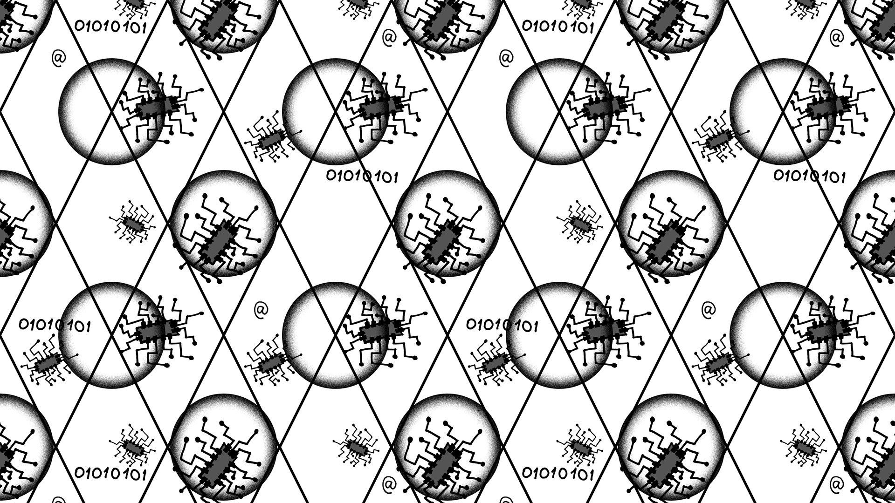

import ObserverPatternVisualizer from '../../../components/interactive/ObserverPatternVisualizer.astro';

Cuando pasas de escribir código que "simplemente funciona" a escribir aplicaciones que deben ser mantenidas durante años por diferentes desarrolladores, te das cuenta de una realidad absoluta: **programar es, en gran medida, comunicación**.

Para evitar reinventar la rueda cada vez que nos enfrentamos a un problema arquitectónico, la ingeniería de software se apoya en los Patrones de Diseño.

## Qué es un Patrón de Diseño

Un patrón de diseño no es un fragmento de código que puedas copiar y pegar, ni una librería que instales con NPM, YARN o cualquier otro gestor de paquetes. Es **una solución general, probada y reutilizable a un problema común** que ocurre dentro de un contexto determinado en el diseño de software.

Piensa en ellos como los planos de un arquitecto. Si quieres construir una puerta, no necesitas inventar el concepto de bisagra; ya existe un plano estándar que te dice cómo hacer que una puerta gire. Los patrones de diseño son esas "bisagras" lógicas para tu código.

> "Los patrones de diseño te proporcionan un vocabulario común. Decir 'He usado un Singleton' o 'Aquí necesitamos un Adapter' le ahorra a tu equipo 20 minutos de explicaciones frente a una pizarra sobre el problema y su solución correspondiente."

## Importancia de estructurar el código

Aplicar patrones de diseño no es una moda, es una necesidad cuando el proyecto escala. Sus ventajas principales a futuro son las siguientes:

- **Mantenibilidad:** El código estructurado bajo un patrón es predecible. Si un nuevo desarrollador entra al equipo, sabrá exactamente dónde encontrar la lógica de creación de usuarios o la gestión de la base de datos.
- **Escalabilidad:** Los patrones fomentan el Bajo Acoplamiento y la Alta Cohesión. Esto significa que puedes cambiar una pieza del sistema sin que este explote y de fallos por todos lado.
- **Ahorro de tiempo:** Al usar soluciones estandarizadas para problemas comunes, reduces drásticamente la cantidad de _bugs_ lógicos en producción.

Los patrones clásicos se dividen en tres grandes categorías:

| Categoría          | Propósito Principal                                                                   | Ejemplo            |
| :----------------- | :------------------------------------------------------------------------------------ | :----------------- |
| **Creacionales**   | Resuelven problemas relacionados con la creación de objetos y clases.                 | Factory, Singleton |
| **Estructurales**  | Se encargan de cómo se componen las clases y objetos para formar estructuras grandes. | Adapter, Decorator |
| **Comportamiento** | Definen cómo se comunican y asignan responsabilidades entre los objetos.              | Observer, Strategy |

## Patrones de Diseño más utilizados

Aunque existen docenas de patrones, en el desarrollo moderno estos son algunos de los más habituales:

**1. Singleton (Creacional)**
Garantiza que una clase tenga una única instancia y proporciona un punto de acceso global a ella. Es extremadamente útil para gestionar configuraciones globales o conexiones únicas a bases de datos.

**2. Observer (De Comportamiento)**
Establece una relación de "uno a muchos". Cuando el objeto principal (el sujeto) cambia su estado, notifica automáticamente a todos los objetos dependientes (los observadores). Si alguna vez has usado `addEventListener` en JavaScript o el estado de React, ya has utilizado este patrón de fondo.

<ObserverPatternVisualizer />

**3. Factory (Creacional)**
Proporciona una interfaz para crear objetos en una superclase, pero permite que las subclases alteren el tipo de objetos que se crearán. Es ideal cuando tu código debe generar distintos tipos de botones, tarjetas o usuarios sin ensuciar la lógica principal con cientos de condicionales `if/else`.

## La sobreingeniería en el diseño

Existe una regla de oro fundamental: **no uses un patrón de diseño si no tienes el problema que este resuelve.**

Cuando descubrimos los patrones por primera vez, es tentador querer aplicarlos a todo, convirtiendo un simple script de 50 líneas en un laberinto de 15 archivos y clases abstractas. Mantén siempre el pragmatismo; el código más limpio es el más simple que resuelve el problema actual mientras deja la puerta abierta a la escalabilidad.

---

## Patrones: Ejemplos prácticos

Como desarrolladores, la mejor forma de entender los conceptos es leyendo código real.

He preparado un repositorio donde documento y aplico varios de estos patrones de diseño (con ejemplos prácticos que puedes ejecutar tú mismo). Échale un vistazo, clónalo para hacer tus propias pruebas y, si te resulta útil, deja una estrella.

También dejo un enlace a una web que detalla a la perfección cómo funciona y los problemas que resuelve cada Patrón de Diseño.

## Referencias

🔗 **[Refactoring.guru - Patrones de Diseño](https://refactoring.guru/es/design-patterns)**

🔗 **[Repositorio con ejemplos en Java](https://github.com/Pabl0Aranda/Proyecto-ISII)**

Design Patterns: Elements of Reusable Object-Oriented Software (Erich Gamma, Richard Helm, Ralph Johnson, John Vlissides)

Head First Design Patterns (Eric Freeman, Elisabeth Robson)
