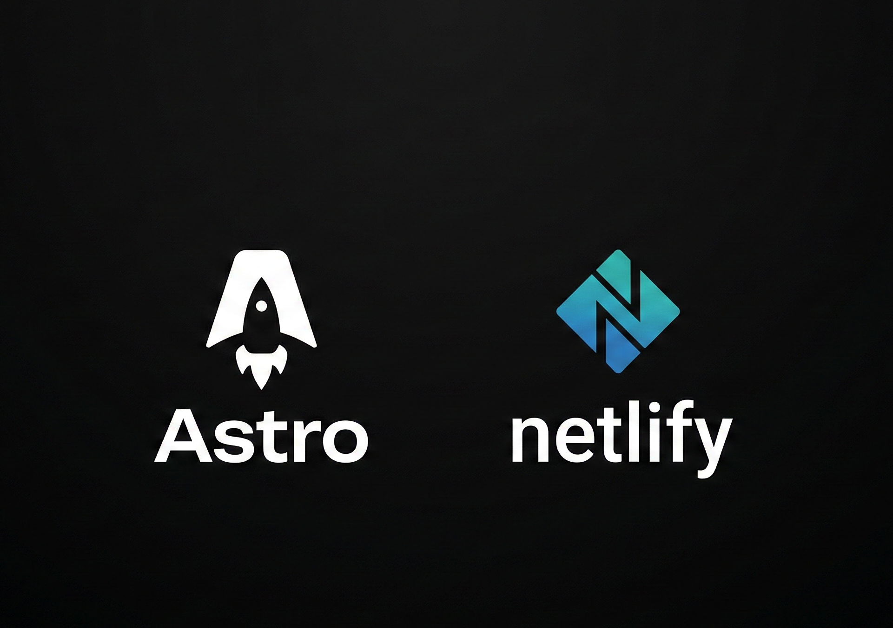

Cuando decidí construir mi portafolio personal, tenía claro un objetivo: quería una web extremadamente rápida, fácil de mantener y con un SEO impecable. Tras evaluar varias opciones en el ecosistema actual, la combinación de **Astro** y **Netlify** fue la elección perfecta.

Aquí te explico por qué considero que es el *stack* definitivo para este tipo de proyectos.

## Astro

Astro es mucho más que un framework; es un motor diseñado específicamente para destacar el contenido. Mientras que herramientas como React o Vue (SPAs) nacieron para crear aplicaciones web complejas (como paneles de control o redes sociales), Astro brilla en portafolios, blogs y *landing pages*.

Su **arquitectura basada en componentes** me ha permitido estructurar la web de forma modular. Cada sección (Experiencia, Proyectos, Contacto) vive en su propio archivo aislado, lo que facilita enormemente la escalabilidad y el mantenimiento del código a medida que el proyecto crece.

## "Zero JS" y la Arquitectura de Islas

Una de las características más potentes de Astro es que, por defecto, **envía cero JavaScript al lado del cliente**.

Esto no significa que no programes en JS. De hecho, toda la lógica, el enrutado y el tipado estricto con TypeScript ocurren en el servidor durante el tiempo de compilación (*build time*). El resultado que recibe el navegador es HTML y CSS puro, ultraligero y rapidísimo de renderizar.

Si en algún momento necesito interactividad real (como un botón complejo o un framework de UI), Astro utiliza lo que se conoce como **Arquitectura de Islas**. Esto permite "hidratar" con JavaScript únicamente ese componente interactivo, dejando el resto de la página estática. Menos carga para el navegador se traduce en métricas perfectas en *Core Web Vitals*.

## Netlify y Jamstack

De nada sirve tener una web rápida y escalable si el proceso de subirla a internet es todo lo contrario.
Aquí es donde entra **Netlify**.

Al integrar mi repositorio de GitHub con Netlify, he configurado un flujo de trabajo **CI/CD (Integración y Despliegue Continuo)** de primer nivel. Ahora, mi enfoque es puramente Jamstack:

* Escribo un nuevo artículo en formato Markdown.
* Hago un `git push` a la rama principal.
* Netlify detecta el cambio, compila la web entera en segundos y la publica globalmente en su CDN.

Además, Netlify Forms me ha permitido integrar un formulario de contacto 100% funcional sin tener que escribir ni mantener una sola línea de código *backend* o configurar bases de datos.

## Conclusión

Construir esta web no solo me ha servido para tener una presencia en internet, sino como un ejercicio práctico para entender la web moderna. Si estás pensando en crear tu propio portafolio, te recomiendo que le des una oportunidad a Astro; la experiencia de desarrollo es bastante satisfactoria.
