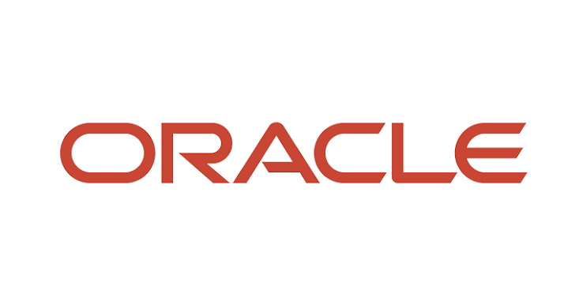
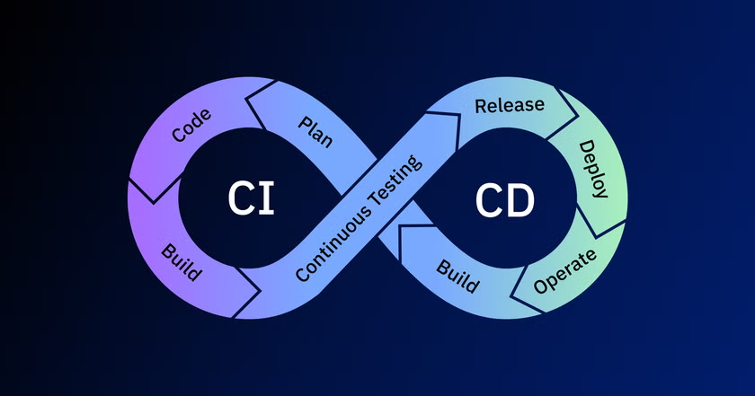

***

title: "Oracle APEX"
date: 2026-07-09
description: "Ventajas del desarrollo Low-Code con Oracle APEX para crear aplicaciones empresariales rápidas y seguras."
draft: false
category: "Desarrollo Web"
heroImage: "/images/Oracle-APEX.png"
------------------------------------

En el complejo ecosistema actual del desarrollo de software, existe una carrera constante por dominar el framework más nuevo, la arquitectura más distribuida o la librería de gestión de estado más reciente. Mientras el mundo frontend debate entre React, Vue, Angular o Svelte, y el backend salta de monolitos a microservicios y funciones *serverless*, las empresas se enfrentan a un problema fundamental: **el coste y el tiempo de desarrollo no dejan de aumentar.**

Desarrollar una aplicación de gestión empresarial (como un CRM, un ERP a medida o un sistema de inventario) requiere configurar repositorios separados, orquestar APIs, lidiar con ORMs, manejar estados en el cliente y asegurar la comunicación entre capas. Todo esto antes de escribir la primera línea de lógica de negocio real.

Aquí es donde entra en juego **Oracle APEX** (Application Express). Una plataforma que, bajo la etiqueta de *Low-Code*, esconde una de las arquitecturas más eficientes y potentes para aplicaciones orientadas a datos. En este artículo, vamos a explorar en profundidad por qué APEX no es "un juguete Low-Code", sino una herramienta de grado empresarial capaz de sostener sistemas críticos a escala mundial.

***

## 1. La Evolución de APEX

Para entender APEX hoy, debemos mirar brevemente al pasado. Originalmente concebido a principios de los 2000 como "HTML DB", fue creado por Mike Hichwa (quien también creó el famoso sistema de encuestas internas de Oracle) y Thomas Kyte. El propósito era claro: permitir a los desarrolladores de bases de datos crear interfaces web rápidamente aprovechando sus conocimientos de SQL y PL/SQL.

Desde entonces, APEX ha evolucionado de forma asombrosa. Atrás quedaron las interfaces toscas de los años 2000. Hoy en día, APEX incluye el **Universal Theme**, un motor de interfaz de usuario totalmente responsivo, accesible e increíblemente moderno. Se despliega en la Nube de Oracle (OCI) bajo servicios administrados como el *Autonomous Database*, ofreciendo un entorno donde la infraestructura es completamente invisible para el desarrollador.

***

## 2. La Arquitectura Centrada en Datos

Para comprender el poder de APEX, debemos comparar su arquitectura con el desarrollo web moderno clásico.

### El modelo tradicional (3 Capas)

1. **Frontend:** Aplicación SPA (Single Page Application) en React o Angular. Maneja el DOM y el estado (Redux, Zustand).
2. **Backend:** Un servidor Node.js, Spring Boot, Python o incluso PHP. Actúa como intermediario, traduciendo peticiones HTTP a consultas SQL mediante un ORM (Prisma, Hibernate, etc.).
3. **Base de datos:** Almacena la información.

En este modelo, mover 1 millón de registros requiere extraerlos de la base de datos, serializarlos en JSON, enviarlos por la red al backend, procesarlos, enviarlos al frontend y renderizarlos. La latencia, el uso de memoria RAM y los cuellos de botella de red son inevitables.

### El Modelo APEX (Arquitectura Cero Latencia)

En Oracle APEX, **la aplicación web vive dentro de la base de datos**.

1. **El Navegador (Cliente):** Envía una petición HTTP.
2. **ORDS (Oracle REST Data Services):** Actúa como el puente web. Recibe la petición HTTP, invoca un procedimiento almacenado en la base de datos y le devuelve al navegador el HTML o JSON resultante.
3. **Base de Datos (Motor APEX):** Genera dinámicamente la página ejecutando SQL y PL/SQL directamente donde residen los datos.

Al ejecutar la lógica de la interfaz exactamente en el mismo procesador y memoria donde residen los datos, **la latencia es cero**. Si necesitas calcular un agregado complejo sobre 50 millones de filas para mostrar un gráfico de resumen, el motor de base de datos de Oracle hace el trabajo pesado a velocidad de hardware, y APEX simplemente renderiza el diminuto resultado final en HTML o JSON.

El infame *glue code* (código de pegamento) que los desarrolladores backend escriben para mapear tablas a JSON simplemente desaparece.

***

## 3. "Low-Code" no significa "Baja Capacidad"

Una de las críticas más comunes (y equivocadas) hacia APEX y los sistemas Low-Code proviene de desarrolladores Full-Stack que asumen que una herramienta de estas características te limita el desarrollo. Piensan que cuando el cliente pide algo que "no está en la caja", el proyecto fracasa. En APEX, esto no podría estar más lejos de la realidad, ya que APEX no te limita el desarrollo, sino que te da las herramientas necesarias para crear aplicaciones web de manera rápida y eficiente.

### Componentes Out-of-the-Box

APEX te permite construir en minutos lo que tomaría semanas en React:

* **Interactive Reports (IR) e Interactive Grids (IG):** Tablas de datos que el usuario final puede filtrar, agrupar, ordenar, pivotar y descargar en Excel/PDF sin que el desarrollador escriba una sola línea de código para esas funcionalidades.
* **Gráficos interactivos:** Impulsados por Oracle JET (librería basada en D3.js y Preact), totalmente conectados a sentencias SQL.
* **Formularios complejos:** Con validaciones maestro-detalle transaccionales automáticas.

### Extensibilidad

Si el componente por defecto no te sirve, APEX te da las llaves del reino:

* **En el Frontend:** Puedes inyectar CSS puro, añadir tus propios archivos `.js` o usar librerías externas (como Chart.js, Three.js o mapas interactivos). APEX provee de potentes APIs en JavaScript (`apex.server`, `apex.item`, `apex.message`) para interactuar asíncronamente con el backend.
* **En el Backend:** No estás limitado a sentencias CRUD. Puedes invocar paquetes PL/SQL inmensos, procesar XML/JSON, conectarte a colas de mensajería (Advanced Queuing) o ejecutar algoritmos de Machine Learning internos de la base de datos (OML).

APEX es un acelerador, no una limitación. Hace que el 80% del trabajo aburrido sea instantáneo, permitiéndote dedicar tu tiempo al 20% de la lógica de negocio que realmente aporta valor diferencial.

***

## 4. Seguridad Empresarial por Defecto

El desarrollo web tradicional es un campo minado de seguridad. Prevenir Inyecciones SQL, Cross-Site Scripting (XSS) y falsificación de peticiones (CSRF) requiere disciplina constante en cada capa del stack.

Al usar APEX, heredas el paraguas de seguridad de una de las corporaciones más obsesionadas con la seguridad del mundo.

* **SQL Injection:** APEX fuerza y gestiona automáticamente el uso de *Bind Variables* (Variables de enlace). Es casi imposible sufrir inyección SQL accidental en APEX.
* **XSS (Cross-Site Scripting):** Todo el texto que sale de la base de datos hacia el navegador es escapado automáticamente usando funciones nativas como `APEX_ESCAPE`.
* **Session State Protection (SSP):** Las URLs en APEX incluyen sumas de verificación (*checksums*) encriptadas. Si un usuario malintencionado intenta manipular la URL cambiando el ID de un producto de `10` a `11`, APEX lo detecta instantáneamente y bloquea la petición.
* **Autenticación y Autorización:** Integración con un par de clics con LDAP, Microsoft Azure AD, Google (OAuth2 / OpenID Connect) o SAML. Los esquemas de autorización se evalúan en tiempo real antes de renderizar componentes o ejecutar procesos.

Construir esta infraestructura de seguridad desde cero en Express.js o Flask tomaría meses de auditorías; en APEX viene incluido en el paquete base.

***

## 5. Integración Continua, CI/CD y Control de Versiones

Durante mucho tiempo, la mayor debilidad de APEX (y de las bases de datos en general) fue la integración con metodologías ágiles y sistemas de control de versiones como Git. Trabajar con código que "vive" dentro de la base de datos dificultaba las revisiones de código (Pull Requests).

Hoy, el ecosistema de herramientas de Oracle ha solucionado este paradigma brillantemente:

* **APEX Export en formato legible (Split JSON/SQL):** Permite descomprimir una aplicación APEX en cientos de pequeños archivos de texto que Git puede monitorizar a la perfección.
* **SQLcl y Liquibase:** Oracle ha adoptado fuertemente Liquibase, permitiendo aplicar control de versiones estricto a las tablas, vistas y al propio código APEX.
* **Pipelines en GitHub Actions / GitLab CI:** Es completamente posible configurar un flujo donde un *push* a la rama `main` despliega automáticamente los cambios incrementales de la base de datos y la aplicación APEX en el entorno de Producción sin intervención manual.

***

## 6. Integración: Consumiendo y Exponiendo APIs

Ninguna aplicación moderna vive aislada. APEX brilla en el ecosistema de los microservicios gracias a dos pilares fundamentales:

### REST Data Sources

Puedes conectar una aplicación APEX a una API externa (por ejemplo, la API de GitHub, Stripe o un microservicio interno) de forma declarativa. Una vez configurada, puedes crear reportes, gráficos y formularios sobre esos datos JSON externos **exactamente con la misma facilidad que si fueran tablas locales**, e incluso mapear operaciones de actualización (POST/PUT/DELETE) automáticamente.

### ORDS (Oracle REST Data Services)

De la misma forma que consumes APIs, APEX y ORDS te permiten **exponer tus tablas y paquetes PL/SQL como APIs REST ful** en minutos. Con protección OAuth2 integrada, puedes convertir tu lógica de base de datos en un microservicio altamente seguro para que aplicaciones móviles (React Native, Flutter) u otros sistemas empresariales lo consuman.

***

## 7. Rendimiento y Escalabilidad

El rendimiento de una aplicación APEX es, esencialmente, el rendimiento de la Base de Datos Oracle que tiene debajo. Y pocas cosas en el mundo del software manejan datos mejor que un motor Oracle bien optimizado.

Al ser una arquitectura sin estado (*stateless*) en el servidor de aplicaciones web (el estado de la sesión se guarda eficientemente en la BD), puedes colocar un balanceador de carga frente a múltiples instancias de ORDS. Si la base de datos crece, Oracle soporta tecnologías como **RAC (Real Application Clusters)** o **Data Guard**, garantizando disponibilidad del 99.995%.

En el contexto moderno del Cloud, el servicio **Autonomous Database** automatiza la creación de índices y la optimización de consultas usando Machine Learning. Esto significa que la base de datos se afina a sí misma en base a los patrones de uso de tus usuarios de APEX, sin necesidad de un DBA (Administrador de Base de Datos) dedicado a tiempo completo.

***

## 8. Casos de Uso Ideales (y cuándo NO usar APEX)

Como cualquier herramienta técnica, APEX no es una bala de plata. Es importante identificar su nicho exacto.

### Cuándo APEX es la herramienta perfecta:

* **Aplicaciones Internas (Backoffice):** Paneles de control empresariales, sistemas de RRHH, gestores de inventario.
* **Sustitución de Excel:** Reemplazar procesos de negocio críticos que actualmente residen en hojas de cálculo frágiles enviadas por correo.
* **Modernización de Sistemas Legacy:** Especialmente la migración masiva de sistemas antiguos desarrollados en *Oracle Forms*.
* **Desarrollo Rápido (RAD):** Cuando el *Time-to-Market* es crítico y la aplicación se centra fundamentalmente en manipular datos relacionales.

### Cuándo NO deberías usar APEX:

* **Aplicaciones B2C de alta interacción fluida:** Si estás creando un clon de Spotify, Instagram o un editor colaborativo en tiempo real (tipo Figma o Google Docs), necesitas un control absoluto del DOM y WebSockets (React/Vue son mejores aquí).
* **Procesamiento que no es de datos:** Aplicaciones que requieren procesamiento de video, manipulación de imágenes masiva en el servidor, o tareas que encajan mejor en un contenedor de microservicios.

***

## 9. El Retorno de Inversión (ROI) y Costes

Aquí radica una de las mayores ventajas corporativas: **Si tienes una licencia de Oracle Database, APEX es gratuito**. No hay costes adicionales por asientos, por número de desarrolladores o por aplicaciones creadas.

Incluso para startups o proyectos personales, Oracle ofrece la capa "Always Free" en OCI (Oracle Cloud Infrastructure) que incluye 2 bases de datos autónomas con APEX preinstalado, gratuitas de por vida.

El ROI se hace evidente cuando equipos de 2 o 3 desarrolladores de PL/SQL pueden entregar proyectos que tradicionalmente requerirían un equipo de 8 personas (expertos en frontend, backend, devops y dba).

***

## Conclusión

Oracle APEX ha desafiado la noción de que construir aplicaciones empresariales fiables requiere arquitecturas inmensamente complejas. Al centrar la computación en los datos y automatizar de forma inteligente la generación de la interfaz, reduce enormemente la deuda técnica de las empresas.

Para los desarrolladores web tradicionales, la curva de aprendizaje inicial implica un cambio de mentalidad: dejar de pensar en "rutas, controladores y estados de componentes" y empezar a pensar puramente en "datos, consultas y flujos lógicos".

Para aquellos con sólidos conocimientos en SQL y modelos relacionales, APEX representa una facilidad increíble. Te permite convertir tus scripts y consultas en aplicaciones completas, seguras e impresionantes en una fracción del tiempo, entregando valor real al negocio de manera ágil y sostenible. En un mundo sobrecomplicado, la elegancia de esta plataforma sigue siendo un soplo de aire fresco.

***

## Referencias

* **Oracle APEX Official Documentation.** (2026). *Oracle APEX Architecture and Overview*. Disponible en: [https://apex.oracle.com](https://apex.oracle.com)

* **Kyte, T.** (2014). *Expert Oracle Database Architecture*. Apress.

* **Hichwa, M.** (2020). *The History of Oracle APEX*. Presentaciones y notas de Oracle OpenWorld.

* **Oracle REST Data Services (ORDS).** [https://www.oracle.com/database/technologies/appdev/rest.html](https://www.oracle.com/database/technologies/appdev/rest.html)

* **Comunidad APEX World.** [https://apex.world](https://apex.world)

* **Kallman, J.** (Varios años). Artículos sobre "Low-Code vs High Control" y la evolución del Universal Theme.
