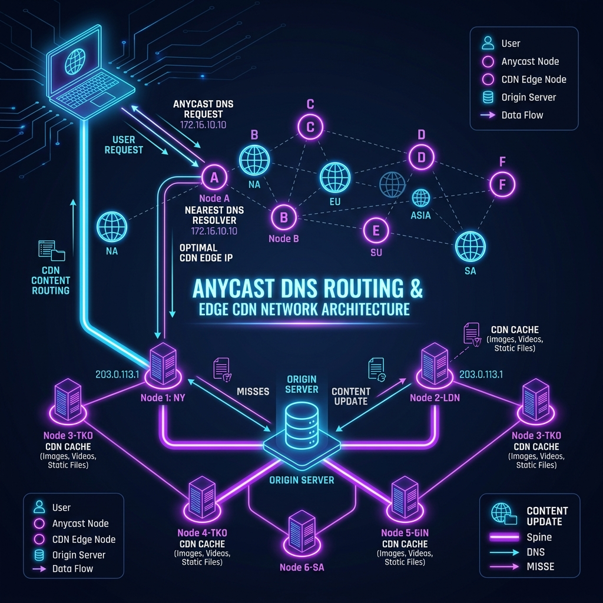
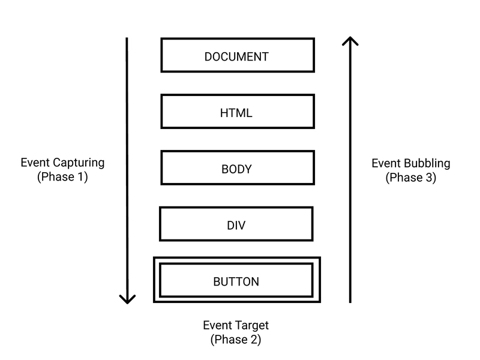

import RoutingSimulator from "../../../components/interactive/RoutingSimulator.astro";

El ecosistema de desarrollo de software moderno ha evolucionado más allá de la mera escritura de código y el diseño de interfaces. Un portafolio técnico, una aplicación web o una plataforma distribuida ya no se evalúan únicamente por la elegancia de sus algoritmos o la optimización de sus _assets_ estáticos. El verdadero estándar de ingeniería y arquitectura de software se demuestra en la capacidad de gestionar el ciclo de vida completo del producto. Esto engloba la infraestructura de red, el enrutamiento seguro de dominios (DNS), la observabilidad del tráfico en tiempo real y una estrategia sólida de analítica orientada a la explotación de datos (_Data Exploitation_).

En este extenso artículo, desglosaré el proceso integral de despliegue en producción de la arquitectura de este portafolio, construido sobre **Astro**. Abordaremos los retos inherentes a la migración de dominios desde paneles de registro _legacy_, la inyección segura y asíncrona de Google Tag Manager (GTM) respetando los _Core Web Vitals_, y la depuración avanzada de eventos en el **DOM** (Document Object Model) para lograr una trazabilidad milimétrica del comportamiento del usuario.

---

## 1. Topología de Red y Enrutamiento

El primer hito crítico en el ciclo de vida de despliegue de cualquier aplicación es asegurar que la resolución de nombres sea rápida, resiliente y geográficamente distribuida. En este caso, el objetivo era dotar al proyecto de una identidad profesional robusta (`pabloaranda.net`) abandonando el alojamiento estático tradicional en favor de una **Red de Distribución de Contenidos (CDN) en el _Edge_** como la proporcionada por Netlify.



<br />

### La Transición al Edge y la Delegación de Zonas

A nivel conceptual, delegar la gestión del DNS a un proveedor de CDN transforma radicalmente la forma en la que se sirven las peticiones. En lugar de resolver el dominio contra un único servidor monolítico, el DNS de Netlify (basado en NS1) enruta dinámicamente al usuario hacia el nodo más cercano físicamente, minimizando la latencia de red y el _Time to First Byte_ (TTFB).

**1. Declaración del Dominio y Configuración Anycast:**

En primera instancia, el dominio se vincula lógicamente en el panel de Netlify. Esto aprovisiona recursos en su capa de balanceo de carga global (Anycast) y prepara la emisión automática de certificados TLS/SSL a través de Let's Encrypt, garantizando que todo el tráfico fluya sobre HTTPS de manera nativa sin intervención manual.

**2. Delegación de _Nameservers_:**

El paso definitorio es la modificación de la zona raíz en el registrador de dominios original. Este proceso transfiere la autoridad de resolución (registros A, CNAME, TXT, etc.) a la infraestructura del proveedor de alojamiento.

### Resolución de Conflictos en Registradores Legados

Durante esta fase, es común enfrentarse a limitaciones técnicas en las interfaces de registradores de dominios más antiguos. A menudo, estos paneles fallan al intentar delegar servidores de nombres personalizados (`ns1.netlify.com`, `ns2.netlify.com`) basándose únicamente en sus nombres de host directos. Esto puede deberse a políticas restrictivas o a sistemas de validación desactualizados.

**Solución de Arquitectura:**

Para sortear este bloqueo sin comprometer la integridad del despliegue, la técnica consiste en forzar la resolución manual de las direcciones IP de los _nameservers_ de destino mediante _ping_ o búsquedas `dig` / `nslookup`, e introducir directamente estas IPv4 en el panel del registrador. Esta estrategia garantiza una redundancia completa en la capa de enrutamiento y previene caídas críticas durante el período de propagación de los registros (que por el TTL puede extenderse de 24 a 48 horas).

A continuación se muestra una simulación interactiva de cómo funciona este enrutamiento DNS Anycast y CDN Edge en la práctica:

<RoutingSimulator />

---

## 2. Telemetría Desacoplada e Implementación de Tag Management Systems

Una vez que la red y la entrega de contenido están securizadas, el siguiente pilar es la **observabilidad**. Entender cómo interactúan los visitantes con una aplicación no debe comprometer su rendimiento. Integrar Google Analytics 4 directamente en el código fuente es una mala práctica arquitectónica porque acopla fuertemente el marketing y la analítica a la base de código.

La solución adoptada es **Google Tag Manager (GTM)**, que actúa como una capa de abstracción y middleware para la inyección de scripts.

### Beneficios del Desacoplamiento

- **Rendimiento Asíncrono:** GTM se inyecta de forma que no bloquea el hilo principal de renderizado del navegador. Esto es vital para pasar satisfactoriamente las métricas de rendimiento web.
- **Inyección mediante Variables de Entorno (CI/CD):** Para mantener las credenciales y los IDs de seguimiento confidenciales, especialmente al alojar el código en repositorios públicos como GitHub, el ID del contenedor GTM se configura como una variable de entorno inyectada durante la fase de _build_.

```astro
<!-- Fragmento conceptual de integración segura en Astro -->{
  import.meta.env.PUBLIC_GTM_ID && (
    <script
      is:inline
      set:html={`
      (function (w, d, s, l, i) { ... })(window, document, "script", "dataLayer", "${import.meta.env.PUBLIC_GTM_ID}");
    `}
    />
  )
}
```

_Este patrón asegura que el ID dinámico solo se resuelva en el momento de compilación en los servidores de Netlify, evitando exponer claves de infraestructura críticas en el código base._

---

## 3. Arquitectura del Data Layer

La métrica tradicional de "páginas vistas" aporta un valor analítico ínfimo en el contexto de SPAs o arquitecturas modernas. Un portafolio profesional es un embudo de conversión; el objetivo es demostrar competencias técnicas y convertir visitantes en contactos profesionales.

Para ello, diseñé una **taxonomía de eventos estratégicos** que permite cuantificar el interés real de manera determinista:

- **Descarga de Recursos:** Activadores que escuchan clics específicos en URLs que resuelven hacia extensiones `.pdf`.
- **Rebotes a Redes Profesionales:** Trazabilidad de la migración de la audiencia hacia plataformas como LinkedIn, un indicador claro de "Lead Calificado".
- **Exploración de Código Fuente:** Interacciones dirigidas hacia los repositorios de GitHub. La innovación aquí radica en capturar de forma dinámica qué proyecto está recibiendo el clic utilizando variables nativas del **Data Layer**. Así, el _backend_ analítico no solo sabe que alguien fue a GitHub, sino a qué repositorio (ej: `Astro-Portfolio` vs `AI-Microservice`), revelando qué tecnologías resultan más atractivas para los usuarios u otros desarrolladores.

---

## 4. Event Bubbling y Discrepancias

Implementar eventos en papel es sencillo, pero en el entorno caótico del DOM de un navegador real, la teoría a menudo colisiona con la arquitectura de renderizado.

### El Problema de Diagnóstico

Durante la fase de validación de calidad de datos (_Data Quality Assurance_), la consola de _Preview_ de GTM reveló un comportamiento erróneo: la captura de clics hacia los repositorios de GitHub arrojaba valores `undefined` o rutas truncadas en la variable nativa `Click URL`.

### Análisis del Event Bubbling

Tras una sesión de _debugging_ a bajo nivel de la estructura del árbol del DOM, identifiqué el fenómeno de **Event Bubbling** en JavaScript.



<br />

Observa la estructura típica de un botón en una interfaz web:

```html
<a
  href="https://github.com/usuario/repo-interesante"
  class="magnetic-btn"
  data-project-title="Portfolio"
>
  <svg width="24" height="24"><!-- Ícono de GitHub --></svg>
  <span>Auditar Código Fuente</span>
</a>
```

Cuando un usuario interactúa con la interfaz, rara vez hace clic en el área vacía del enlace `<a>`. Suelen hacer clic sobre el texto (`<span>`) o sobre la iconografía (`<svg>`).
En JavaScript, los eventos se originan en el nodo más profundo que recibió la interacción y "burbujean" hacia arriba a través de sus ancestros.

El activador estándar de GTM estaba interceptando el clic en el elemento `<span>` o `<svg>`. Como estos elementos internos carecen nativamente del atributo `href` (que pertenece a su contenedor padre `<a>`), GTM era incapaz de resolver el destino del clic, generando eventos huérfanos o con datos nulos.

### Selectores CSS Jerárquicos y Matching Ascendente

Modificar la estructura del HTML o forzar atributos `pointer-events: none` en todos los hijos es un _antipatrón_ que ensucia el CSS y daña la accesibilidad. La solución verdaderamente escalable debía vivir en la capa analítica de GTM.

En lugar de confiar en variables estáticas, reescribí los triggers utilizando **Selectores CSS Avanzados**. Modificamos el motor de reglas de GTM para que no evalúe estrictamente el elemento clicado, sino que recorra el DOM buscando coincidencias.

La configuración del activador quedó así:

- **Tipo de Activador:** Clic en Todos los Elementos (All Elements).
- **Condición de Disparo:** Coincidencia con selector CSS (`matches CSS selector`).
- **Regla:** `a[href*="github.com"], a[href*="github.com"] *`

**¿Por qué funciona esto?**
El selector `a[href*="github.com"]` captura los clics perfectos sobre la capa del enlace. La adición crucial es `a[href*="github.com"] *` (nótese el espacio y el asterisco). Esta sintaxis instruye al motor de GTM a interceptar cualquier clic que ocurra en **cualquier elemento descendiente** (como el span o el svg) de un ancla que apunte a GitHub.

Adicionalmente, para simplificar la nomenclatura y la escalabilidad, inyectamos atributos de datos personalizados (ej. `data-project-title={title}`) en los componentes de Astro. Esto nos permite extraer metadatos de alto valor directamente desde el elemento HTML sin depender de expresiones regulares complejas sobre la URL.

---

## 5. Calidad del Dato y Limitaciones Técnicas

El último paso de toda canalización de datos (_pipeline_) es asegurar su validez antes de entrar en producción.

**1. Auditoría en Tiempo Real con DebugView:**
A través de la consola DebugView de Google Analytics 4, monitorizamos las tramas de red. Verificamos que al hacer clic profundo en un componente anidado, GA4 recibiese el payload completo: el nombre del evento (`generate_lead` o `project_click`) acompañado de los parámetros exactos (`project_name`, `destination_url`).

**2. La Realidad de las Discrepancias:**
Es vital como ingenieros reconocer las limitaciones del ecosistema. Aunque el entorno controlado mostraba un 100% de precisión, los reportes consolidados en GA4 invariablemente reflejarán lo que se conoce como _Missed Events_. Esta pérdida de datos se debe a:

- Navegadores con políticas severas de privacidad (Brave, Firefox ETP, Safari ITP).
- Bloqueadores de contenido (AdBlock, uBlock Origin) que interceptan los scripts de `gtag.js` y `gtm.js`.
- Latencia de red o usuarios abandonando la página antes de que el _beacon_ analítico finalice su transmisión.

Estas discrepancias son aceptables y forman parte de la madurez de la analítica moderna; la analítica web no es un sistema contable (donde 1+1 debe ser siempre 2), sino una herramienta probabilística de tendencias.

---

## 6. Inteligencia de Datos

Construir esta canalización limpia y libre de errores de burbujeo es solo la fase fundamental. Tener una recolección estructurada de eventos abre la puerta a la verdadera ciencia y explotación de datos:

- **Medición de Profundidad de Pantalla (Scroll Depth Tracking):** Para artículos de ingeniería y Machine Learning de gran extensión, entender en qué punto exacto abandona el lector permite optimizar la arquitectura de la información y la ubicación de las conclusiones clave.
- **Cuadros de Mando en Looker Studio y BigQuery:** La telemetría capturada por GA4 puede ser volcada automáticamente mediante conectores hacia Data Warehouses como Google BigQuery, permitiendo realizar agregaciones complejas mediante SQL y construir cuadros de mando operativos en tiempo real en Looker Studio.

---

## Conclusión

Este ejercicio demuestra de manera práctica que el desarrollo de software moderno no concluye con una compilación exitosa y un simple `git push`. La responsabilidad arquitectónica se extiende mucho más allá, abarcando el diseño y mantenimiento de sistemas observables, cuantificables, resilientes y preparados para la inteligencia de negocio. Integrar prácticas robustas de DevOps y Analítica Avanzada diferencia a una aplicación web tradicional de una plataforma de alto rendimiento lista para escalar.

---

## Referencias

- [Documentación Oficial de Google Tag Manager (GTM)](https://developers.google.com/tag-manager/web/guides)
- [Gestión de DNS en Netlify (Netlify Docs)](https://docs.netlify.com/domains-https/manage-domains/)
- [Core Web Vitals y Rendimiento (Google Developers)](https://web.dev/vitals/)
- [Guía de Implementación de Eventos GA4 (Google Analytics)](https://developers.google.com/analytics/devguides/collection/ga4/events?client_type=gtag)
- [Event Bubbling y Capturing en JavaScript (MDN Web Docs)](https://developer.mozilla.org/es/docs/Learn/JavaScript/Building_blocks/Events#burbujeo_y_captura_de_eventos)
