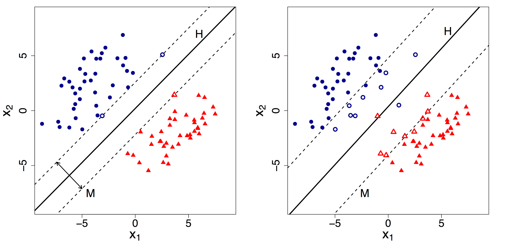
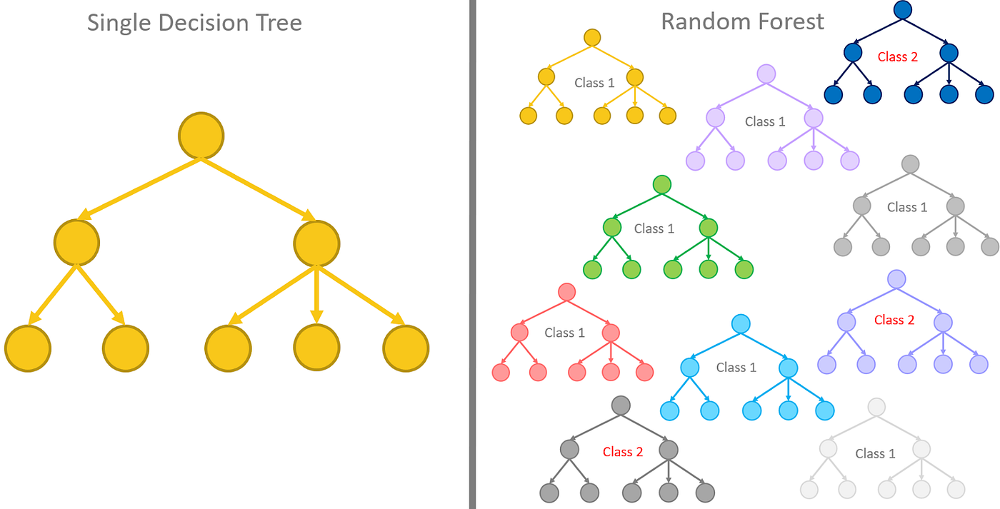
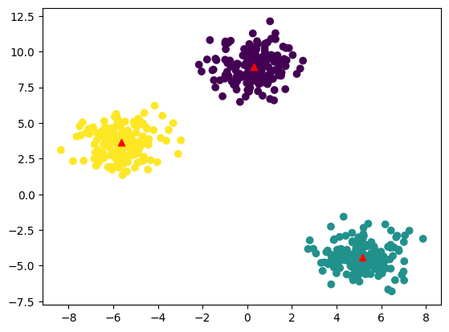
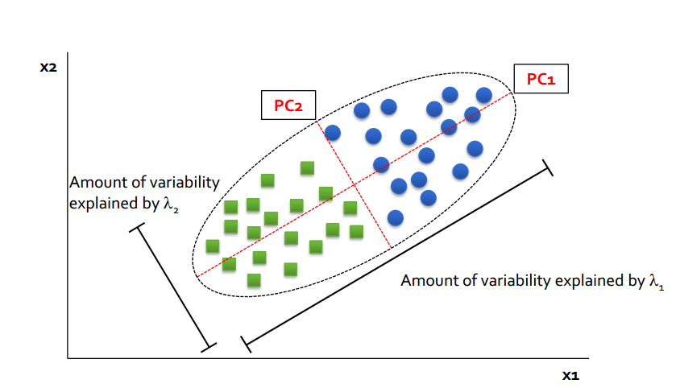

## Introducción

En el desarrollo de software tradicional, escribimos reglas explícitas (código algorítmico) que procesan datos para producir un resultado determinista. En **Machine Learning (ML)**, invertimos el paradigma: introducemos datos y resultados históricos esperados para que el sistema infiera de manera probabilística las reglas subyacentes.

Sin embargo, como advirtió Google en su famoso _paper_ ["Machine Learning: The High-Interest Credit Card of Technical Debt"](https://static.googleusercontent.com/media/research.google.com/es//pubs/archive/43146.pdf), no podemos tratar estos modelos como cajas negras mágicas. Cada algoritmo posee una arquitectura matemática interna, una huella de memoria específica y un comportamiento asintótico [(Notación Big O)](https://pabloaranda.netlify.app/blog/algoritmos/notacion-big-o/) que determinará si nuestro sistema escalará eficientemente en producción o colapsará bajo estrés al integrarse en nuestra API.

A continuación, analizaremos la base teórica y computacional de los algoritmos clásicos, clasificados por su naturaleza de aprendizaje.

---

## 1. Aprendizaje Supervisado: Regresión y Clasificación

El Aprendizaje Supervisado se aplica cuando cada elemento de nuestro conjunto de datos de entrenamiento posee una etiqueta (_label_) u objetivo conocido. Se divide principalmente en problemas de **Regresión** (predecir un valor continuo, como el precio de un servidor) y **Clasificación** (predecir una categoría discreta, como "tráfico legítimo" o "ataque DDoS").

### A. Regresión Lineal y Regularización

Es el algoritmo base para predecir variables cuantitativas continuas. Intenta modelar la relación entre una variable dependiente ($Y$) y un vector de variables independientes ($X$) ajustando un hiperplano geométrico.

Matemáticamente, busca minimizar la función de coste del **Error Cuadrático Medio (MSE)**:

$$MSE = \frac{1}{n} \sum_{i=1}^{n} (y_i - \hat{y}_i)^2$$

**¿Cómo se entrena?**
Existen dos formas de encontrar los pesos óptimos:

1.  **Ecuación Normal:** Resuelve el problema analíticamente con álgebra lineal: $\theta = (X^T X)^{-1} X^T y$. Su complejidad computacional es de $O(p^3)$ al invertir la matriz, donde $p$ es el número de características (_features_). Inviable para miles de variables.
2.  **Descenso del Gradiente (Gradient Descent):** Un enfoque iterativo que actualiza los pesos en la dirección opuesta al gradiente de la función de coste. Reduce la complejidad temporal a $O(k \cdot n \cdot p)$, donde $k$ es el número de iteraciones.

**Regularización (L1/L2)**
En la vida real, los modelos lineales sufren de _overfitting_ (sobreajuste). Para evitarlo, sumamos una penalización a la función de coste:

- **L2 (Ridge Regression):** Penaliza el cuadrado de los pesos. Previene que ninguna variable domine el modelo y soluciona problemas matemáticos cuando la matriz $X^T X$ no es invertible.
- **L1 (Lasso Regression):** Penaliza el valor absoluto de los pesos, forzando a que muchos de ellos se vuelvan exactamente cero. Actúa como un selector de características integrado, ideal para ahorrar memoria.

- **Complejidad en Inferencia:** $O(p)$ - Extremadamente rápido y eficiente en memoria RAM (solo guarda un vector de pesos), ideal para sistemas embebidos (Edge AI) o microcontroladores.

### B. Regresión Logística

A pesar de su nombre, es el estándar industrial para la **clasificación binaria**. Transforma la salida de la combinación lineal utilizando la **función sigmoide**, limitando el resultado estrictamente a un rango probabilístico entre 0 y 1.

$$\sigma(z) = \frac{1}{1 + e^{-z}}$$

En lugar del MSE, utiliza la **Entropía Cruzada Binaria (Log Loss)** como función de coste, penalizando fuertemente las predicciones seguras pero incorrectas:

$$J(\theta) = - \frac{1}{m} \sum_{i=1}^{m} [y_i \log(\hat{y}_i) + (1-y_i)\log(1-\hat{y}_i)]$$

- **Complejidad en Inferencia:** $O(p)$. Al igual que la regresión lineal, la predicción solo requiere un producto escalar y la aplicación de la sigmoide.
- **Caso de uso típico:** Filtros de spam, detección de transacciones fraudulentas o estimación de clics en anuncios (CTR).

### C. K-Nearest Neighbors (KNN)

KNN es un algoritmo de clasificación y regresión que destaca por su aproximación de "aprendizaje perezoso" (_lazy learning_). No existe una fase de entrenamiento real; el algoritmo simplemente memoriza todo el _dataset_.

Para clasificar un nuevo punto de datos, calcula la distancia (Euclídea o Manhattan) contra todos los puntos almacenados y asigna la clase mayoritaria de sus $K$ vecinos más cercanos.

- **Complejidad en Entrenamiento:** $O(1)$. No hace cálculos, solo guarda datos.
- **Complejidad Espacial:** $O(n \cdot p)$. Devora la memoria RAM, ya que requiere tener todo el conjunto de datos cargado.
- **Complejidad en Inferencia:** $O(n \cdot p)$. Pésimo para producción a gran escala. Para predecir un solo dato, debe calcular la distancia contra millones de registros, a menos que se optimice usando estructuras de datos avanzadas como KD-Trees ($O(p \log n)$).

### D. Support Vector Machines (SVM)

Las Máquinas de Vectores de Soporte buscan encontrar el hiperplano óptimo que no solo separa las clases, sino que **maximiza el margen** entre ellas (la distancia a los puntos más cercanos, llamados vectores de soporte).

Una de las principales ventajas del SVM es su capacidad para manejar datos no lineales mediante el **Kernel Trick**. Cuando los datos no son separables linealmente (no puedes trazar una línea recta entre ellos), el Kernel (como el RBF - Radial Basis Function) proyecta matemáticamente los datos a dimensiones superiores donde sí son separables por un plano hiperdimensional, sin el inmenso coste computacional de transformar realmente los datos.

- **Complejidad en Entrenamiento:** $O(n^2)$ a $O(n^3)$. Escala mal con conjuntos de datos grandes.
- **Caso de uso típico:** Clasificación de secuencias de ADN, reconocimiento de imágenes y tareas con miles de dimensiones (alta dimensionalidad) pero pocas muestras.

### E. Árboles de Decisión y Random Forest

Los Árboles de Decisión dividen el espacio de características de manera ortogonal basándose en reglas condicionales imbricadas (`if-else`). Utilizan métricas de la teoría de la información, como la **Entropía**, para encontrar los cortes que maximicen la **Ganancia de Información**.

$$Entropia(S) = - \sum_{i=1}^{c} p_i \log_2(p_i)$$

El problema de un árbol único es que tiende a memorizar el ruido de los datos de entrenamiento (sobreajuste).

Aquí entra el **Random Forest**, un modelo de ensamble (_Ensemble Learning_). Combina múltiples (cientos) de árboles de decisión independientes entrenados con subconjuntos aleatorios de datos y características (técnica de _Bagging_). Cuando se realiza una consulta, todos los árboles "votan" y se devuelve la predicción mayoritaria, reduciendo la varianza de manera significativa.

- **Complejidad en Inferencia (Árbol único):** $O(d)$, donde $d$ es la profundidad máxima del árbol. Es increíblemente rápido para el procesador, ya que son puros saltos condicionales en ensamblador.
- **Complejidad Espacial (Random Forest):** Alta. Almacenar 500 árboles profundos requiere serializar archivos de cientos de megabytes.

---

## 2. Aprendizaje No Supervisado

En el Aprendizaje No Supervisado, los datos no poseen etiquetas objetivo. El sistema debe descubrir estructuras o agrupaciones naturales ocultas en la matriz de información.

### A. K-Means Clustering

Es el algoritmo de agrupamiento (_clustering_) por excelencia. Divide un conjunto de datos en $K$ grupos disjuntos. El proceso iterativo es el siguiente:

1.  **Inicialización:** Se posicionan $K$ centroides aleatoriamente en el espacio dimensional.
2.  **Fase de Asignación:** Cada punto se asigna al centroide más cercano utilizando la distancia Euclídea.
3.  **Fase de Actualización:** Se recalcula la posición de cada centroide como el centro de masas (la media) de todos los puntos asignados a él.
4.  Se repiten iterativamente las fases 2 y 3 hasta que los centroides converjan.

Matemáticamente, busca minimizar la inercia (WCSS - _Within-Cluster Sum of Squares_):

$$WCSS = \sum_{j=1}^{K} \sum_{i \in S_j} ||x_i - \mu_j||^2$$

**El reto:** ¿Cómo sabemos el valor de K?
El algoritmo no sabe cuántos grupos existen. Utilizamos técnicas como el **Método del Codo (_Elbow Method_)**, iterando K desde 1 hasta $N$ y graficando la Inercia. El punto de inflexión ("codo") nos indica el número óptimo de clústeres donde añadir más grupos deja de aportar beneficios significativos.

- **Complejidad Computacional (Entrenamiento):** $O(n \cdot K \cdot p \cdot I)$, donde $I$ es el número de iteraciones.
- **Caso de uso típico:** Segmentación automatizada de clientes por comportamiento de compra, o compresión de imágenes reduciendo millones de colores a una paleta de K colores representativos (Cuantificación de color).

### B. Análisis de Componentes Principales (PCA)

No todos los algoritmos no supervisados buscan agrupar datos; algunos buscan comprimirlos. PCA es una técnica de **Reducción de Dimensionalidad**.

Si tienes una tabla con 500 columnas (características), PCA utiliza la descomposición de valores singulares (SVD) sobre la matriz de covarianza para encontrar nuevos ejes (Componentes Principales) que capturan la máxima varianza de los datos. Esto permite comprimir las 500 columnas originales en, digamos, 20 componentes, reteniendo el 95% de la información original.

- **Impacto Principal:** Es una técnica de preprocesamiento obligatoria cuando se trata de Big Data. Reducir dimensiones de $p$ a $k$ convierte problemas intratables de tiempo $O(n \cdot p^2)$ a rápidos y manejables $O(n \cdot k^2)$, mitigando además la "Maldición de la Dimensionalidad".

---

## 3. Arquitectura: Del Jupyter Notebook a Producción

Como Ingenieros de Software, sabemos que el modelo es solo el 10% del esfuerzo. El 90% restante es desplegarlo, monitorizarlo y mantenerlo vivo. Cuando llevamos el modelo de un entorno local a producción, entran en juego nuevas variables críticas.

### A. Formatización y Serialización (Pickle vs ONNX)

El flujo clásico de Python consiste en entrenar el modelo con _Scikit-Learn_ y guardarlo como un archivo `.pkl` (Pickle). Esto es un riesgo de seguridad (Pickle puede ejecutar código malicioso) y es lento.

En arquitecturas modernas orientadas al rendimiento, los modelos se exportan a **ONNX** (_Open Neural Network Exchange_). ONNX desacopla el modelo de Python, permitiendo que la inferencia se ejecute en servidores backend de C++, Rust o Go con un rendimiento de CPU/GPU inmenso.

### B. Inferencia Online vs. Inferencia Batch

- **Online (Real-Time):** El modelo se expone vía API REST o gRPC (ej. usando FastAPI). Cada petición del usuario requiere una predicción en milisegundos (ej. Detección de fraude al pasar una tarjeta). Prioriza modelos de baja latencia computacional (Regresión Logística, Árboles simples).

- **Batch (Por Lotes):** Las predicciones se calculan de noche sobre miles de registros a la vez almacenados en una base de datos (ej. Precalcular recomendaciones de Netflix). Aquí prima el _throughput_ (rendimiento masivo) sobre la latencia, permitiendo el uso de ensambles pesados y redes neuronales profundas.

### C. La Degradación del Modelo (Data Drift)

El código de software tradicional no "caduca" por sí solo. Sin embargo, los modelos de Machine Learning sí. Si entrenaste un modelo de regresión lineal para predecir precios de viviendas en 2019, la inflación y los cambios económicos de 2024 harán que las predicciones de tu hiperplano sean erróneas hoy en día.

Este fenómeno se llama **Concept Drift** o **Data Drift**. Una buena arquitectura MLOps debe monitorizar la distribución estadística de los datos de entrada en producción frente a los de entrenamiento, y desencadenar _pipelines_ de re-entrenamiento automático cuando las métricas caigan por debajo de los umbrales operativos.

---

## Conclusión

El éxito de una solución de Machine Learning en un entorno de producción industrial no depende exclusivamente de lograr un _Accuracy_ (precisión) del 99% en el laboratorio.

Nuestra responsabilidad es saber elegir el modelo adecuado que equilibre de forma óptima la precisión del negocio, la eficiencia asintótica de los algoritmos y las limitaciones de hardware (CPU, memoria y red) de la infraestructura productiva. A veces, un modelo de regresión lineal que predice en 2 milisegundos con un 85% de precisión es infinitamente más valioso que una red profunda que logra el 90% pero agota la memoria del contenedor y tarda 500 milisegundos en responder.

---

## Referencias

🔗 **[Kaggle: Machine Learning and Data Science Community](https://www.kaggle.com/)**

🔗 **[Scikit-Learn: Machine Learning in Python](https://scikit-learn.org/)**

_Pattern Recognition and Machine Learning_ (Christopher M. Bishop)
