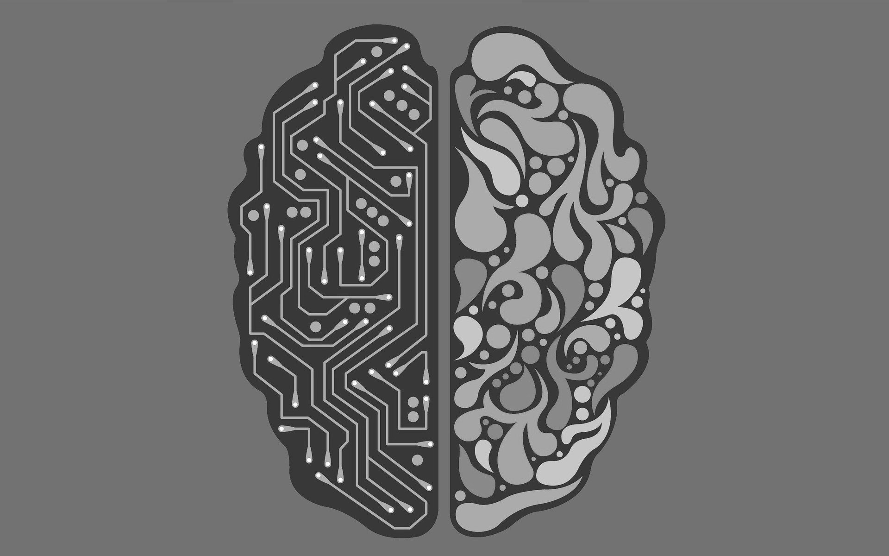

Hoy en día es imposible navegar por internet sin toparse con el término "Inteligencia Artificial" (IA). Sin embargo, a menudo vemos que términos como IA, *Machine Learning* (ML) y *Deep Learning* (DL) se utilizan como si fueran sinónimos, lo cual genera un confuso entendimiento sobre sus diferencias.

Para entenderlo de forma visual, imagina unas muñecas matrioskas: la Inteligencia Artificial es la muñeca más grande que engloba todo. Dentro de ella está el Machine Learning, y dentro de este, una muñeca aún más específica llamada Deep Learning.

En este post se detalla qué hace exactamente cada uno y cuándo deberíamos utilizar uno u otro.

## Machine Learning

El Machine Learning, o Aprendizaje Automático, es una rama de la IA en la que **diseñamos algoritmos que permiten a los ordenadores aprender de los datos** sin ser programados explícitamente para cada regla.

La clave del ML clásico es lo que llamamos **Feature Engineering** (Ingeniería de Características). En el ML, un humano (el científico de datos) tiene que procesar los datos y decirle al algoritmo en qué debe fijarse.

Por ejemplo, si queremos que un algoritmo de ML distinga entre manzanas y naranjas, primero tenemos que extraer características como el peso, el color (RGB) y la textura, y dárselas al algoritmo en una tabla bien estructurada. Con esos datos masticados, algoritmos como los *Árboles de Decisión* o la *Regresión Lineal* actuan como buenos predictores o clasificadores.

* **Casos de uso ideales:** Detección de spam en correos, predicción de precios de viviendas, sistemas de recomendación sencillos...

## Deep Learning

El Deep Learning (Aprendizaje Profundo) es una subdisciplina del Machine Learning que se basa en las **Redes Neuronales Artificiales** (inspiradas en la estructura del cerebro humano). El término "profundo" se refiere a que estas redes tienen múltiples capas ocultas de neuronas procesando la información.

La gran revolución del DL es que **elimina casi por completo la necesidad del *Feature Engineering***.

Si queremos que una red de Deep Learning distinga manzanas de naranjas, no le damos una tabla con pesos y colores. Le pasamos miles de fotos en crudo (píxeles). La primera capa de la red detectará bordes, la segunda detectará formas, la tercera texturas... hasta que la red descubra por sí misma qué hace que una manzana sea una manzana.

* **Casos de uso ideales:** Generación de texto (como ChatGPT), reconocimiento de voz (Siri, Alexa), conducción autónoma (Tesla) y diagnóstico de imágenes médicas.

## Las 4 diferencias fundamentales

Para resumir, aquí tienes las diferencias clave que determinan cuándo usar cada tecnología en un proyecto real:

| Característica | Machine Learning (Clásico) | Deep Learning |
| :--- | :--- | :--- |
| **Volumen de Datos** | Funciona bien con conjuntos de datos pequeños o medianos. | Es un monstruo hambriento. Requiere cantidades masivas de datos para ser preciso. |
| **Hardware Requerido** | Puede ejecutarse y entrenarse en CPUs estándar de cualquier servidor. | Necesita GPUs (Tarjetas Gráficas) muy potentes para hacer millones de cálculos matriciales. |
| **Intervención Humana** | Alta. Requiere estructurar los datos e indicar las características clave (*Feature Engineering*). | Baja. Extrae las características automáticamente a partir de datos en crudo (imágenes, audio, texto). |
| **Explicabilidad** | Alta. Puedes trazar matemáticamente por qué el algoritmo tomó una decisión. | Baja. Es una "Caja Negra" (*Black Box*). A veces ni los ingenieros saben exactamente por qué la red tomó cierta decisión. |

## Conclusión

Como desarrolladores o arquitectos de software, a veces nos dejamos llevar por la tecnología más brillante. El Deep Learning es fascinante, pero computacionalmente es extremadamente caro y complejo.

Si tienes datos estructurados (un Excel o una base de datos SQL) y necesitas predecir las ventas del mes que viene, un algoritmo clásico de Machine Learning lo hará en segundos y con gran precisión. Deja el Deep Learning para cuando tengas que enseñarle a un coche a reconocer una señal de stop bajo la lluvia.
